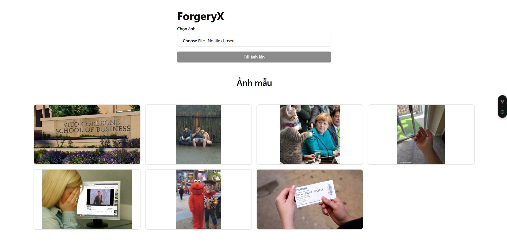
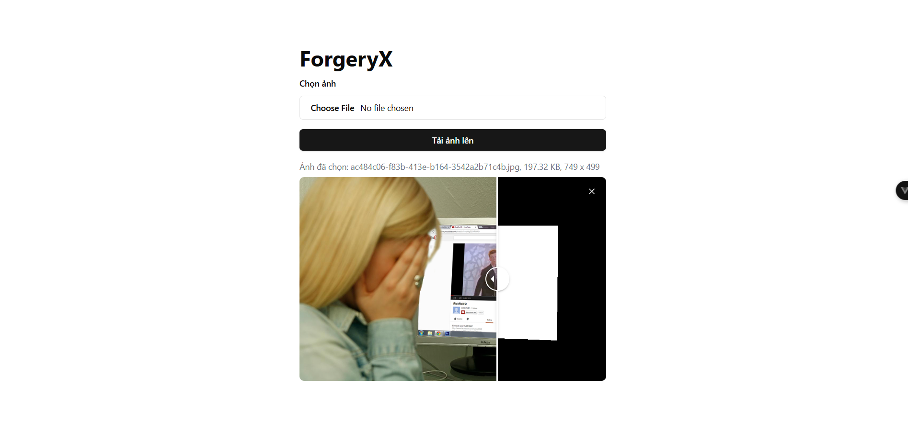
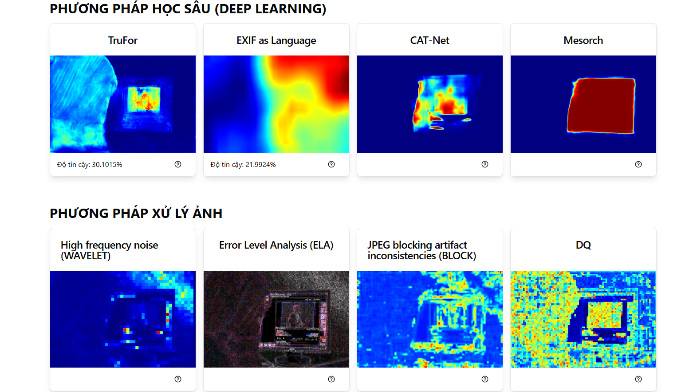
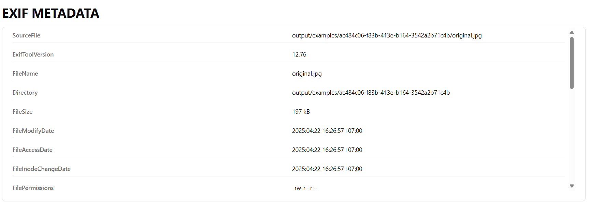
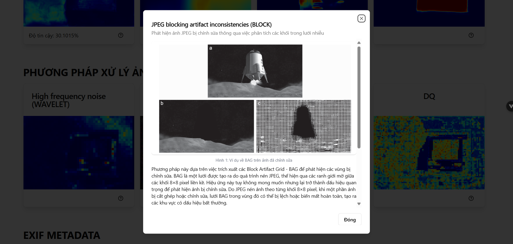

# ForgeryX (Client)

ForgeryX is an image forensics tool designed to detect manipulated images. This repository contains the client-side component built with Vue.js, which provides an intuitive user interface for uploading images and visualizing forgery detection results. It works in conjunction with the ForgeryX server to deliver comprehensive image analysis capabilities.

Check out: [ForgeryX (Server)](https://github.com/bp82125/ForgeryX-Server)

## Example Screenshots






## Technologies Used

- **Vue.js**: Progressive JavaScript framework for building user interfaces
- **Tailwind CSS**: Utility-first CSS framework for styling
- **shadcn-vue**: Vue port of shadcn/ui components for consistent UI design
- **Vite**: Fast build tool and development server

## Getting Started

### Prerequisites

- Node.js version 16 or higher
- npm or yarn package manager

## Installation

### Clone the ForgeryX (Client) Repository

```bash
git clone https://github.com/bp82125/ForgeryX-Client.git
cd ForgeryX-Client
```

### Install Project Dependencies

```bash
# Install the required packages
npm install
```

### Environment Configuration

Copy the example environment file and configure it for your setup:

```bash
cp .env.example .env
```

Update the `.env` file with your server configuration:

```env
VITE_API_URL=http://localhost:8000/api/v1
VITE_BASE_URL=http://localhost:8000
```

- `VITE_API_URL`: The API endpoint URL for the ForgeryX server
- `VITE_BASE_URL`: The base URL for the ForgeryX server

## Run the Project

Once the environment is set up, you can start the development server:

```bash
npm run dev
```

This will launch the application in development mode. You should see an output similar to:

```bash
  VITE v6.1.0  ready in 2689 ms

  ➜  Local:   http://localhost:5173/
  ➜  Network: use --host to expose
  ➜  Vue DevTools: Open http://localhost:5173/__devtools__/ as a separate window
  ➜  Vue DevTools: Press Alt(⌥)+Shift(⇧)+D in App to toggle the Vue DevTools
  ➜  press h + enter to show help
```

The application will be available at `http://localhost:5173/` by default.

## Build for Production

To build the application for production:

```bash
npm run build
```

The built files will be generated in the `dist/` directory.

## License

This project is licensed under the MIT License. See the [LICENSE](LICENSE) file for details.